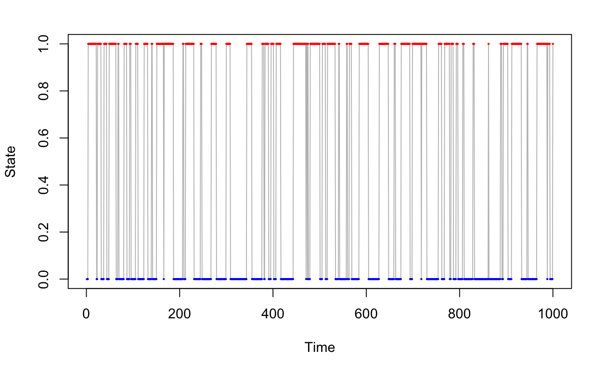
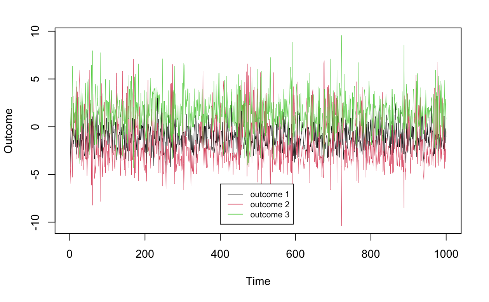

# HMMbayes Overview
This repository is still under development but contains an implementation of a Bayesian 2-state multivariate Hidden Markov Model (HMM). Further functionality to implement a $K$-state multivariate HMM will be added in the future. Source code is located within the ```src``` folder, with all methods entirely self-contained within a single ```.cpp``` file. At the expense of a small computational overhead, parallel computing is supported within the ```HMM_parallel``` file to allow for simultaneous MCMC chains to be run concurrently on separate threads. Code test cases are provided in the ```simulation.Rmd``` file located within the ```analysis``` directory. A real-world example is demonstrated in the ```portfolio_allocation.Rmd``` file, modeling returns and portfolio allocation weights for an all-ETF portfolio.

# Functionality
These instructions will assume installation and use of RStudio. I futher assume the installation and use of the $\texttt{C++}$ header libraries ```RcppArmadillo```, ```RcppDist```, and ```RcppThread```, if parallel processing is desired. After the ```.cpp``` is compiled, a single R function labeled ```gibbs``` or ```gibbs_parallel``` will be available within the workspace. To fit the model, simply provide the requisite arguments that include the data and prior hyperparameters. 

# Example
Consider a latent Markovian dynamical system $S_t\in\{0,1\}$ for $t\in\{0,\ldots,T\}$ that determine the multivariate Gaussian sampling distribution at time $t$. To visualize, see the following simulated latent binary stochastic process:

<p align="center">

</p>

Based on these latent "regimes", the sampling model for a multivariate outcome $y_t\in\mathbb R^{p}$ becomes $y_t\sim \mathcal N_p(\boldsymbol \mu_{S_t}, \boldsymbol \Sigma_{S_t})$. Let's assume $p=3$ for simplicity and generate an observation process based upon these latent states:

<p align="center">

</p>

To fit a single-threaded HMM to this example series $y_{1:1000}$, call the function 
```
gibbs(niter=5000, burnin=2500, y=y, mu0=mu00, Sigma0=Sigma00, v0=v00, S0 = S00, h=10, nugget=0, m=0)
```
for specified function arguments. To briefly explain the necessary arguments,

- ```mu0``` and ```Sigma0``` are the moments for the prior on each regime's mean, i.e., $\mu_{S_t} \sim \mathcal N(\mu_{0}, \boldsymbol \Sigma_{0})$
- ```v0``` and ```S0``` are the inverse Wishart hyperparameters for the prior on $\boldsymbol \Sigma_{S_t}$, i.e., $\Sigma_{S_t}\sim \texttt{Inverse-Wishart}(v_0, S_0)$
- ```h``` is the desired forcast length for the posterior predictive distribution
- ```nugget``` can be useful for numerical stability by adding a small term to the diagonal of $\boldsymbol\Sigma_{S_t}$
- ```m``` is relevant for portfolio allocation, but otherwise irrelevant for utilizing the vanilla HMM functionality 

Further methodolical details and examples are provided in the ```.Rmd``` files located in the ```analysis``` directory.

